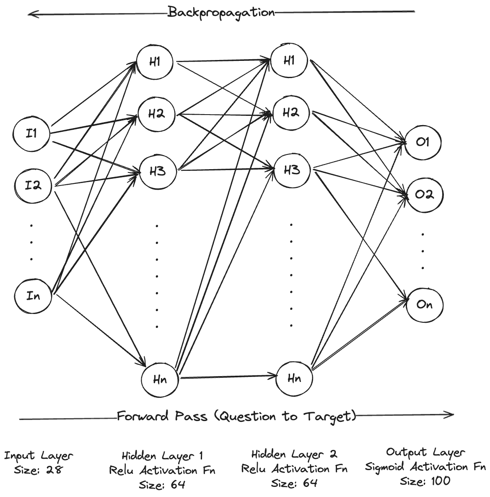
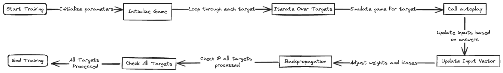
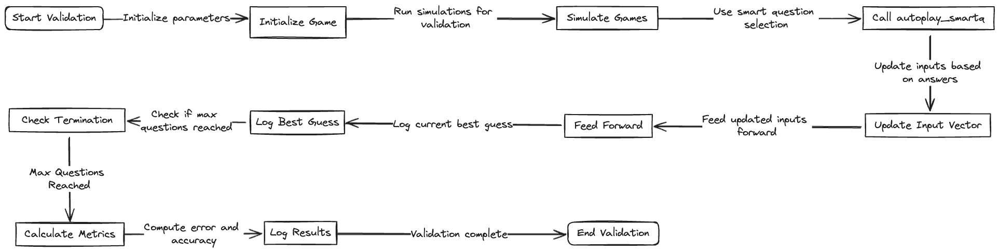

# 20 Questions Game with Neural Network

## Overview

This project implements a 20 Questions game using a neural network to predict the animal the user is thinking of. The game interacts with the user through a Streamlit web app, asking up to 20 yes/no questions to guess the animal. The neural network is trained on a dataset of animals and their characteristics, and it learns to make better guesses over time as it is updated with new data.

## Tech Stack

- **Python**: The main programming language used for implementing the game logic and neural network.
- **NumPy**: For numerical operations, particularly for the neural network's calculations.
- **Streamlit**: For creating the interactive web application.
- **CSV**: The dataset of animals and their characteristics is stored in a CSV file.
- **JSON**: Used to save and load the trained neural network model.
- **Poetry**: For managing dependencies and project configuration.

## Files

- `main.py`: Contains the main functions for training, validating, and testing the neural network.
- `game.py`: Defines the `Q20Game` class, which handles the game logic and interaction with the neural network.
- `neural.py`: Defines the `DualModeNeuralNetwork` class, implementing the neural network used in the game.
- `zoo.py`: Defines the `Zoo` class, which loads and handles the dataset of animals and their characteristics.
- `app.py`: The Streamlit app that provides the interactive interface for playing the game.
- `data/zoo.csv`: The dataset of animals and their characteristics.
- `pyproject.toml`: The configuration file for Poetry.

## How It Works

### Neural Network

The neural network used in this project is a dual-mode neural network with two hidden layers. It is designed to handle both forward and backward propagation for training and making predictions.

#### Architecture

- **Input Layer**: Receives the input vector representing the answers to the questions asked so far.
- **Hidden Layers**: Two hidden layers that process the inputs using an activation function (ReLU, Sigmoid, Tanh, or Softmax).
- **Output Layer**: Produces the output vector representing the probability distribution over the possible animals.

#### Activation Functions

- **ReLU (Rectified Linear Unit)**: `relu(x) = max(0, x)`
- **Sigmoid**: `sigmoid(x) = 1 / (1 + exp(-x))`
- **Tanh (Hyperbolic Tangent)**: `tanh(x) = (exp(x) - exp(-x)) / (exp(x) + exp(-x)))`
- **Softmax**: `softmax(x) = exp(x - max(x)) / sum(exp(x - max(x)))`

#### Training

The network is trained using backpropagation, where it adjusts the weights and biases based on the error between the predicted output and the actual target. The learning rate determines the step size for the weight updates.

#### Saving and Loading

The trained model can be saved to a JSON file and loaded later to avoid retraining.

#### Neural Network Architecture



### Game Mechanics

The game interacts with the user by asking yes/no questions about the animal they are thinking of. It uses the neural network to make predictions based on the user's answers and tries to guess the animal within a limited number of questions.

#### Steps

1. **Initialize**: Load the dataset and initialize the neural network.
2. **Ask Questions**: The game selects the best question to ask based on the current state of the neural network and the answers given so far.
3. **Update State**: Update the input vector with the user's answer and recalculate the neural network's output.
4. **Make a Guess**: After a certain number of questions, the game makes a final guess about the animal.
5. **Feedback**: The user provides feedback on whether the guess was correct. If not, the correct animal is provided, and the neural network is updated accordingly.

## Training and Validation Techniques

The training and validation of the neural network follow a structured workflow:

### Training Workflow

1. **Start Training**: Initialize parameters and the game.
2. **Loop Through Targets**: Iterate over each target in the dataset.
3. **Simulate Game**: Call the `autoplay` method to simulate the game for each target.
4. **Update Input Vector**: Update the input vector based on the answers.
5. **Backpropagation**: Adjust the weights and biases of the neural network.
6. **End Training**: Check if all targets are processed and finalize the training.

### Validation Workflow

1. **Start Validation**: Initialize parameters and the game.
2. **Simulate Games**: Run simulations for validation.
3. **Use Smart Question Selection**: Call the `autoplay_smartq` method to use smart question selection.
4. **Update Input Vector**: Update inputs based on answers.
5. **Feed Forward**: Log the current best guess.
6. **Calculate Metrics**: Compute error and accuracy.
7. **Log Results**: Log the validation results.
8. **End Validation**: Complete the validation process.

### Training and Validation Strategy Diagram

- Training Strategy
  

- Validation Strategy
  

## Dataset

The dataset used in this project is the `zoo.csv` file, which contains a list of animals and their characteristics. Each row represents an animal, and each column represents a characteristic (e.g., hair, feathers, eggs, etc.). The dataset is used to train the neural network to recognize patterns and make predictions based on user inputs.

## Running the Application

1. **Install Poetry**:

   ```bash
   pip install poetry
   ```

2. **Install Dependencies**:

   ```bash
   poetry install
   ```

3. **Prepare Dataset**: Ensure the `data/zoo.csv` file is in the correct location and contains the data for the game.

4. **Run the Streamlit App**:

   ```bash
   poetry run streamlit run app.py
   ```

5. **Interact with the App**: The app will ask you questions, and you can answer with "Yes" or "No". The app will then try to guess the animal you are thinking of.

## Training and Testing

The neural network can be trained, validated, and tested using different modes in `main.py`:

- **Training**:
  ```bash
  poetry run python main.py train
  ```
- **Testing**:
  ```bash
  poetry run python main.py test
  ```
- **Hyperparameter Tuning**:
  ```bash
  poetry run python main.py hyperparameter
  ```

## References

- R. Burgener, “ARTIFICIAL NEURAL NETWORK GUESSING METHOD AND GAME,” 20060230008A1, 2006.
- earthtojake, “earthtojake/20q,” GitHub, Sep. 18, 2023. [https://github.com/earthtojake/20q/tree/master](https://github.com/earthtojake/20q/tree/master) [Accessed 24-Jul-2024].

## Future Improvements

- Enhance the dataset with more animals and characteristics.
- Implement more sophisticated question selection algorithms.
- Improve the neural network architecture for better accuracy.

## Conclusion

This project demonstrates a practical application of neural networks in a classic 20 Questions game. The integration with Streamlit provides an interactive and user-friendly interface, making it easy to interact with the game and observe the neural network's performance.
